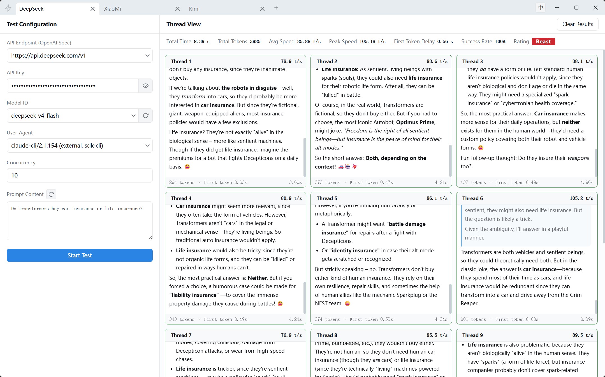

# How many tokens per second?

[中文介绍](doc/README_ZH.md)

A lightweight desktop app for benchmarking LLM API token generation speed. Test any OpenAI-compatible API endpoint with real-time SSE streaming, concurrent load testing, and multi-tab configuration management.



## Features

- **Real-time Speed Benchmarking** — Measure tokens-per-second (TPS) with live SSE streaming updates
- **Concurrent Load Testing** — Run 1 to 100 parallel threads to stress-test API throughput
- **Multi-Tab Configuration** — Manage multiple test configurations side-by-side in separate tabs
- **Broad API Support** — 24 preset endpoints including OpenAI, Groq, DeepSeek, Moonshot, Zhipu, Alibaba Cloud, Tencent Cloud, Baidu, Volcano Engine, OpenRouter, Nvidia NIM, SiliconFlow, and more
- **Auto Model Discovery** — Fetch available model lists directly from the API provider
- **Custom User-Agent** — Spoof or identify with custom UA strings (5 presets included)
- **Random Prompt Pool** — Load prompts from file or use built-in defaults; randomize with one click
- **Rich Metrics** — Track average TPS, peak TPS, first-token latency, success rate, and an overall rating
- **Markdown & Math Rendering** — Model responses rendered with full Markdown and LaTeX math support
- **Bilingual UI** — English and Chinese interfaces with one-click switching
- **Persistent Configs** — All tab configurations are auto-saved and restored on launch
- **Desktop Native** — Frameless Tauri window with custom title bar, native context menus, and platform-native controls

## Tech Stack

- **Frontend**: Vue 3 (Composition API) + TypeScript + Vite
- **State Management**: Pinia
- **UI Components**: Element Plus + custom SCSS design system
- **Internationalization**: vue-i18n
- **Desktop Runtime**: Tauri 2 (Rust backend with reqwest for SSE streaming)
- **Token Counting**: js-tiktoken (cl100k_base)
- **Markdown Rendering**: markdown-it + markdown-it-mathjax3

## Usage

1. **Enter API details** — Select or type your endpoint, paste your API key, and choose a model (or fetch the list automatically).
2. **Set concurrency** — Choose how many parallel threads to run (1–100).
3. **Customize prompt** — Type your own or click the refresh button for a random prompt.
4. **Start the test** — Click "Start Test" and watch real-time results stream in.
5. **Review results** — Check per-thread stats, aggregated summary, and the final rating.

## Rating System

| Rating | Avg TPS | Condition |
|---|---|---|
| Beast | ≥ 78 | Success rate ≥ 70%, first token ≤ 20s |
| Top Tier | ≥ 38 | Success rate ≥ 70%, first token ≤ 20s |
| Excellent | ≥ 28 | Success rate ≥ 70%, first token ≤ 20s |
| Average | ≥ 15 | Success rate ≥ 70%, first token ≤ 20s |
| Poor | < 15 | — |

## Project Structure

```
src/
  domain/          — Entities, interfaces, and business logic (framework-agnostic)
  infrastructure/  — API adapters, test engine, storage implementations
  presentation/    — Vue components, views, Pinia stores, i18n, styles
src-tauri/
  src/             — Rust backend (SSE streaming, HTTP fetch, window controls, config persistence)
```

## Development

```bash
npm run tauri dev    # Run in development mode (Rust backend + frontend hot reload)
npm run tauri build  # Build production executable (NSIS installer on Windows)
```

## License

MIT License
