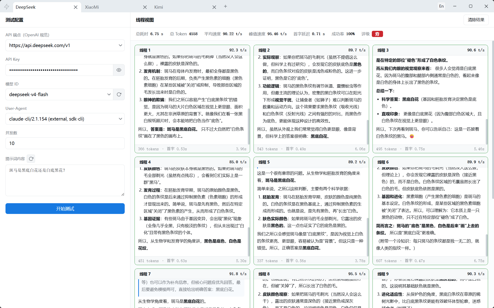

# 每秒输出多少 Token？

[English README](../README.md)

一款轻量级桌面应用，用于对 LLM API 的 Token 生成速度进行基准测试。支持任何兼容 OpenAI 规范的 API 端点，具备实时 SSE 流式监控、并发压力测试和多标签页配置管理功能。



## 功能特性

- **实时速度测试** — 通过 SSE 流式传输实时测量每秒输出 Token 数（TPS）
- **并发压力测试** — 支持 1~100 个并行线程，模拟真实高并发场景
- **多标签页管理** — 多个测试配置以独立标签页并排管理，互不干扰
- **广泛的 API 支持** — 内置 24 家主流厂商预设端点，涵盖国内外平台
- **自动获取模型列表** — 一键拉取供应商当前可用的模型清单
- **自定义 User-Agent** — 可自由设定 UA 标识（内置 5 种预设）
- **随机提示词池** — 支持从文件加载提示词库，一键随机切换
- **丰富的统计指标** — 平均 TPS、峰值 TPS、首字延迟、成功率及综合评级
- **Markdown 与数学公式渲染** — 模型回复支持完整的 Markdown 和 LaTeX 数学公式展示
- **双语界面** — 中英文一键切换，贴合不同用户习惯
- **配置持久化** — 所有标签页配置自动保存，下次启动自动恢复
- **原生桌面体验** — 无框 Tauri 窗口，自定义标题栏，原生右键菜单与平台化窗口控件

## 技术栈

- **前端框架**: Vue 3（Composition API）+ TypeScript + Vite
- **状态管理**: Pinia
- **UI 组件**: Element Plus + 自定义 SCSS 设计系统
- **国际化**: vue-i18n
- **桌面运行时**: Tauri 2（Rust 后端，通过 reqwest 实现 SSE 流式请求）
- **Token 计数**: js-tiktoken（cl100k_base）
- **Markdown 渲染**: markdown-it + markdown-it-mathjax3

## 使用说明

1. **填写 API 信息** — 选择或输入端点地址，粘贴 API Key，选择模型（或自动拉取模型列表）。
2. **设置并发数** — 设定并行线程数量（1~100）。
3. **自定义提示词** — 手动输入或点击刷新按钮随机生成提示词。
4. **开始测试** — 点击「开始测试」，实时观看各线程数据流式回显。
5. **查看结果** — 查看每个线程的详细统计、汇总数据以及最终评级。

## 评级体系

| 评级 | 平均 TPS | 前提条件 |
|---|---|---|
| 夯 | ≥ 78 | 成功率 ≥ 70%，首字延迟 ≤ 20s |
| 顶级 | ≥ 38 | 成功率 ≥ 70%，首字延迟 ≤ 20s |
| 人上人 | ≥ 28 | 成功率 ≥ 70%，首字延迟 ≤ 20s |
| NPC | ≥ 15 | 成功率 ≥ 70%，首字延迟 ≤ 20s |
| 拉完了 | < 15 | — |

## 项目结构

```
src/
  domain/          — 实体、接口与业务逻辑（无框架依赖）
  infrastructure/  — API 适配器、测试引擎、存储实现
  presentation/    — Vue 组件、视图、Pinia Store、国际化、样式
src-tauri/
  src/             — Rust 后端（SSE 流式传输、HTTP 请求、窗口控制、配置持久化）
```

## 开发

```bash
npm run tauri dev    # 开发模式运行（Rust 后端 + 前端热更新）
npm run tauri build  # 构建生产可执行文件（Windows 下生成 NSIS 安装包）
```

## 许可证

MIT License
